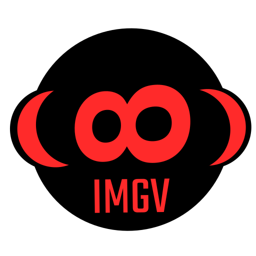

<p align="center">
<a href="https://github.com/dheerajshenoy/imgv">

</a>
</p>

**IMGV**. The Image Viewer no one asked for. Written in C++. Only for **Linux**. With [features](#features) I wanted in my dream image viewer.

Total lines of code excluding the external libraries (Sol, rapidjson, qmarkdowntextedit) is 4617 lines (source and header file).

# Table of Contents

1. [Screenshots](#screenshots)
2. [Demo](#demo)
3. [Introduction](#introduction)
4. [Features](#features)
5. [Supported Image Formats](#supported_image_formats)
6. [Installation](#installation)
7. [Theming](#theming)
8. [Configuration](#configuration)
8. [Changelogs and Bug fixes](#changelogs)
9. [Todo](#todo)
10. [Thanks](#thanks)

<a name="screenshots" />

# Screenshots


R E T R O artwork by [Xeno_Sid](https://www.artstation.com/xeno_sid/).

# Demo

[Link for the demo](https://drive.google.com/file/d/1KKOTOjRqxaw1tly8BbbVPjO5muqZQuip/view?usp=sharing)

<a name="introduction" />

# Introduction

IMGV is an image viewer aiming for the balance between minimalism and features. The aim is simple. Display IMAGES....quickly, switch between them, do whatever the user wants it to do (through a little bit of scripting).

## Ehh....Why ?

Why ? I never liked any of the image viewers existing for linux, with the exception of nomacs. I did not like the super minimal approach of sxiv/nsxiv image viewer, and I did not like the full blown features of heavy image viewer. I just want something to open, click, press and it should do what I need it to do. This pretty much does the job for me.

## Why the name IMGV ?

IMaGe Viewer ~ IMGV. **Original**.

<a name="features" />

# Features

1. Minimally intrusive user-interface
2. Everything is customizable
3. Session file support

    Session files allow you to group images together to open it at a later point. *NOTE*: Previously session files were just plain text files, but since the addition of notes features, session files are now stored as json files with the extension .imgv.
   
6. Command line arguments support.
    - `-i` or `--input` takes in path to one or more image files of the supported format.
    - `-n` or `--no-config` load the software without any lua configuration
    - `-l` or `--list-sessions` list all the sessions
    - `-s` or `--session` takes path to a session file. Loads all the images of that session 

7. Notes


8. Image Properties (with EXIF support)


9. Color Picker

https://github.com/user-attachments/assets/e8c96010-0017-4c47-bb98-c01d3615962a

10. Minimap

https://github.com/user-attachments/assets/793d495a-4149-4766-a402-439dbce5320a

11. Tags

Tags allow you to group images inside a session into a kind of sub-groups so that you can view these groups easily. You can filter them using the filter option in the thumbnail panel to view images beloging to the tags if there are any in the session.

12. STDIN capable (pipe capable)

You can "pipe into" imgv to open the files. Best example is editing image using ImageMagick and then pipeing it into imgv to view it.

```shell
magick some-file.jpg -blur 0x8 - | imgv -
```

<a name="supported_image_formats" />

# Supported Image Formats

IMGV uses [ImageMagick](https://imagemagick.org/) image library for decoding image formats, which therefore means that imgv supports all the image formats supported by ImageMagick. Check [this](https://imagemagick.org/script/formats.php#supported) page for the list of all supported Image Format.

(Before imgv 2.0l Qts default image decoders were used to load the images.)

<details>

- **3FR**: Hasselblad 3F RAW image
- **AI**: Adobe Illustrator file
- **ART**: AROPA ART image
- **ARW**: Sony Alpha RAW image
- **AVS**: AVS (American Virtual Space) image
- **BMP**: Microsoft Windows Bitmap
- **BRF**: Braille
- **BRK**: Braille
- **CALS**: CALS Raster format
- **CGM**: Computer Graphics Metafile
- **CR2**: Canon RAW version 2 image
- **CRW**: Canon RAW image
- **CUR**: Microsoft Windows cursor
- **DIB**: Device Independent Bitmap
- **DJVU**: DjVu image
- **DPX**: Digital Picture Exchange image
- **DNG**: Adobe Digital Negative
- **DOT**: DOT graph file
- **EPI**: Encapsulated PostScript image
- **EPX**: EPX image
- **EXR**: OpenEXR image
- **FITS**: Flexible Image Transport System
- **FLIF**: Free Lossless Image Format
- **FLV**: Flash Video
- **GIF**: Graphics Interchange Format
- **HEIC**: High Efficiency Image Coding
- **HEIF**: High Efficiency Image Format
- **ICO**: Microsoft Windows Icon
- **IMAGE**: Generic image
- **INFO**: Image metadata
- **IPTC**: IPTC metadata
- **J2K**: JPEG 2000 image
- **JNG**: JPEG Network Graphics
- **JPEG**: JPEG image
- **JPG**: JPEG image
- **JXR**: JPEG XR image
- **K25**: Kodak K25 image
- **KDC**: Kodak DC120 image
- **MAP**: Image map
- **MNG**: Multiple-image Network Graphics
- **MOS**: Leaf RAW image
- **MRW**: Minolta RAW image
- **MTV**: MTV video
- **NEF**: Nikon Electronic Format image
- **ORF**: Olympus RAW image
- **PBM**: Portable Bitmap
- **PCD**: Kodak Photo CD image
- **PCL**: Printer Command Language
- **PCX**: PC Paintbrush image
- **PGM**: Portable Graymap
- **PNG**: Portable Network Graphics
- **PPM**: Portable Pixmap
- **PSD**: Adobe Photoshop image
- **RAS**: Sun Raster image
- **RGB**: RGB image
- **RGBA**: RGB image with alpha channel
- **RW2**: Panasonic RAW image
- **SGI**: Silicon Graphics image
- **SPP**: Sony RAW image
- **SVG**: Scalable Vector Graphics
- **TGA**: Truevision TARGA image
- **TIFF**: Tagged Image File Format
- **WEBP**: WebP image
- **WMF**: Windows Metafile
- **XBM**: X Bitmap
- **XPM**: X PixMap
- **XWD**: X Window Dump
- **YUV**: YUV image
</details>


<a name="installation" />

# Installation

## Install from release package

Check out the [releases](https://github.com/dheerajshenoy/imgv/releases) page for packages.

### Ubuntu users

The DEB package has been built using Ubuntu 24.04 base. It should work on most of the modern ubuntu base distro.

### Arch Linux users

- download the PKGBUILD file and install the program using the following command.

`mkdir imgv && wget https://github.com/dheerajshenoy/imgv/releases/download/1.2.0/PKGBUILD && makepkg -si`

- download the pkg.tar.zst file directly from the [releases](https://github.com/dheerajshenoy/imgv/releases) page and install it using `pacman -U <downloaded-file-name>`

### Flatpak

Install instruction for your distro can be found [here](https://flatpak.org/setup/)

- hazzle free, no need to download any stupid dependencies, no BS, just straight to the point.
- download the flatpak from the [releases](https://github.com/dheerajshenoy/imgv/releases) page.
- **NOTE**: The user configuration and sessions in the case of imgv flatpak are stored at `~/.var/app/org.dheerajshenoy.imgv/config/`
- Also, to do the theming for the flatpak version, please check [link1](https://itsfoss.com/flatpak-app-apply-theme/), [link2](https://www.reddit.com/r/flatpak/comments/y9jmqj/the_general_flatpak_qt_and_gtk_theming_guide/)


## Build from Source

1. This software depends on the following programs/libraries. Install them first.

    1. Qt (GUI)
    2. lua
    3. webp (for WEBP image support)

2. Run the following set of commands

```
git clone https://github.com/dheerajshenoy/imgv.git
cd imgv
mkdir build
cmake -Bbuild -DCMAKE_BUILD_TYPE=Release -DCMAKE_INSTALL_PREFIX=/usr
cd build && make
sudo make install
```

These commands do the following things

- Clone this repo.
- Go the project directory make a build directory and run the cmake command to generate the makefile
- Finally run the make command and also install it system wide

<a name="theming" />

# Theming

The theme for IMGV depends on the theme set for Qt6 applications. There is a handy tool called `qt6ct`. Install it and configure the theme and it will be applied to this software also.

For flatpak version of the app, the theming is a bit of a problem. It can be done, but there are few steps, which can be done following few tutorials like [link1](https://itsfoss.com/flatpak-app-apply-theme/), [link2](https://www.reddit.com/r/flatpak/comments/y9jmqj/the_general_flatpak_qt_and_gtk_theming_guide/).

<a name="changelogs" />

# Configuration

IMGV can be configured using the lua programming language. `config.lua` file should have already been created at the config location. A [config.lua](./config.lua) file can be found in the repo which lists out all the options along with their different options. Just move the file to the config directory and it will be loaded the next time you open imgv.

Note that if the `keybindings` table is present in the `Defaults` table, then default keybindings will not be loaded.

# Changelogs and Bug Fixes

- 18 Aug 2024

    - Added CMYK, HSLA, and alpha to HSV, RGB for the color picker
    - Fix: Reload color picker pixmap on loading an image
    - Added copy to clipboard on doubleclick support for color picker colors
    - Use ImageMagick library to load images and not use Qt6 in-built image decoders. This allows for larger support of images for imgv. Check [here](https://imagemagick.org/script/formats.php#supported) for the supported formats.

- 17 Aug 2024

    - Add `const`, `noexcept` to functions.
    - Make function arguments `const` if not being changed.
    - Pass function arguments by reference and allow function arguments to get value by rvalue.

- 16 Aug 2024
    - STDIN images now create temporary files which are destroyed when the program exits.
    - Make small functions inline for increased performance.
    - Change Image properties layout to QFormLayout for less code.
    - Open session using just the name (with or without the .imgv extension) or full path.
    - Add fit to width, height menu option.
    - Add fit on load (width, height and none) menu option.
    - Color picker functionality even for GIFs!
    - Fix: Minimap toggle bug.
    - Fix: minimap weird placement at startup.
    - Fix: STDIN file being opened as a regular file bug.
    - Fix: remaining files read through the command line.
    - Fix: drag and drop of multiple files.
    - Fix: reading image from STDIN.
    

- 15 Aug 2024
    - Make minimap render over the graphicsview instead of being a widget on the panel.

      This is the old minimap:
      
      

      This is the new minimap:

      

    - Add tag features
    - Create and assign tags for images in a session.
    - Fit image on load option.
    - Added more configuration options to lua.
    - Add full path tooltip to each thumbnail.
    - Add sessions to the open session menu as they are created in app.
    - Close and clear the notes editor once the session is closed.
    - Read binary image data from the standard input (piped input).
    - Fix: bug where spawning a new instance of imgv would freeze due to stdin
    - Add pixel analyser as member function of ImageWidget
    - Clicking after pix analysis mode stops the color picking mode with the last pixel color clicked staying intact.
    - Fix: bug in filter tag when switching tag filter

- 14 Aug 2024
    - Minimap
    - Remove caching of unwanted pixmaps. It just slowed down panning.
    - Remove highlight after removing image from thumbnail
    - Resize thumbnailview scrollbar after removing images
    - Added more lua configuration options
    - Fit on load option
    - Hover label for file path

- 13 Aug 2024
    - Created new logo
    - Added logo to the AboutDialog
    - Icons have been removed (looks messy)
    - Minimal color picker has been added
    - Version 1.3
    - Slideshow
    - Highlight current file during slideshow
    - Zoom percentage statusbar widget

- 12 Aug 2024
    - Rebuild DEB package which was f'ed last time.

- 11 Aug 2024
    - Create Flatpak for imgv

- 09 Aug 2024
    - Open sessions from Manage Session Dialog
    - Change build system from qmake to cmake

- 08 Aug 2024

    - Remove & Rename session files
    - Bulf remove session files. Ask confirmation based on number of files selected.
    - Removed `QListWidget` and replaced with `QListView`
    - Added search feature for thumbnails
    - Added note functionality
    - Changed session file format to json files for easy reading
    - Added dependency for rapidjson
    - Show note modification status on the statusbar
    - Markdown Highlighting support for the Note Widget
    - Lua support for configuration
    - Display full image properties

    

- 07 Aug 2024

    - EXIF Metadata support (JPEG metadata)
    - Added Image Caching support through `QPixmapCache`
    - Added icons

- 06 Aug 2024

    - Add support for GIF and WEBP (libwebp) format.
    - `--input` option directory as argument fix
    - Close sessions
    - Don't ask for save session each time after opening a session

<a name="todo" />

1. [ ] Nested SVG files are not loaded by Qt Pixmap. Maybe try to integrate an SVG library and render SVG through data
2. [ ] Highlight currently displayed file in the thumbnail panel
3. [x] Color picker for gifs (currently works only on static images)
4. [ ] Slideshow show current progress, pause and play instead of starting from the beginning each time

<a name="thanks" />

# Thanks

Thanks to [Xeno_Sid](https://www.artstation.com/xeno_sid/) for letting me use his artwork for the screenshot.

I want to thank the authors of the following projects I have integrated in this software.

1. [Sol2](https://github.com/ThePhD/sol2)
2. [QMarkdownTextEdit](https://github.com/pbek/qmarkdowntextedit)
3. [ArgParse](https://github.com/p-ranav/argparse)
4. [libwebp](https://github.com/webmproject/libwebp)
5. [EasyEXIF](https://github.com/mayanklahiri/easyexif)
6. [rapidjson](https://github.com/tencent/rapidjson)

